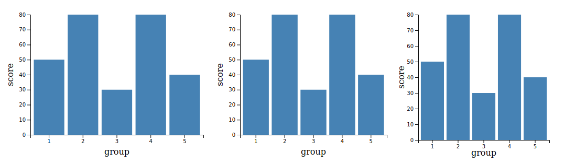
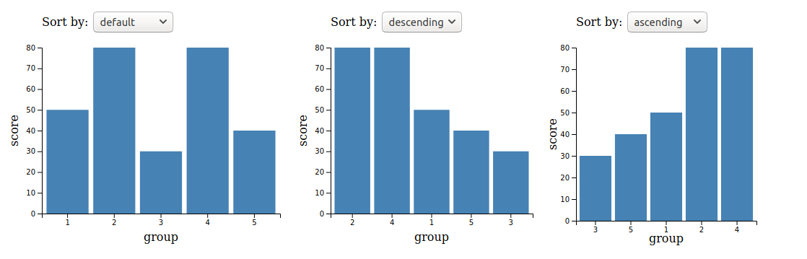
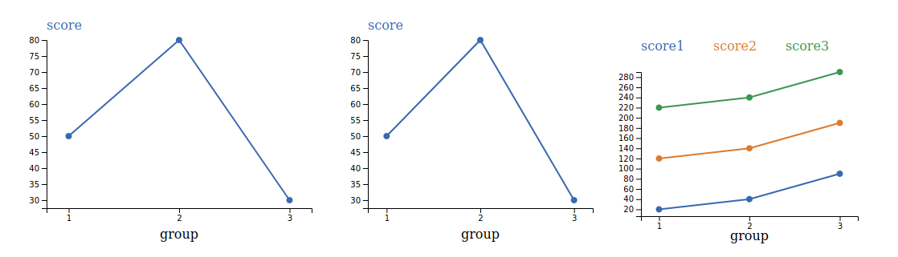
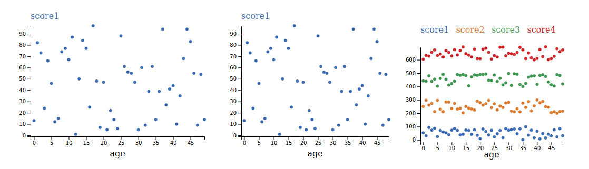

# yd3, an easy to use data visualization javascript library build on top of d3
### @author Yalin Chen yc.about@gmail.com   
Copyright 2020 Yalin Chen

## Why
d3 is so great but is so hard to use. yd3 makes it as simple as calling a function: `yd3.sortableBar(data);`

## How to use
1. Add this yd3 library to your html:  
`<script src='` ****your yd3 library file path**** `'></script>`
2. Use it as normal javascript (write any line below above):
```
<script>
let data = [{"group":1,"score":50},{"group":2,"score":80},{"group":3,"score":30}];
yd3.sortableBar(data);
</script>
```
or add to your html file:  
`<script src='` ****your js file path**** `'></script>`  

your js file: 
```
let data = [{"group":1,"score":50},{"group":2,"score":80},{"group":3,"score":30}];
yd3.sortableBar(data);
```

note: This library packed d3v5 (Copyright 2020 Mike Bostock) into it.


## Functions API

### bar(data, options = {})
This function draws a horizontal bar graph (y represents continuous value) using d3 and svg.  
* @param {object} data    
    A data object array in the format of `[{ columnX: 'a', columnY: n1 },{columnX: 'b', columnY: n2 }]`.  
* @param {object=} options 
    An optional object contains following objects.   
    size, describing the svg size in the format of `size: { width: 400, height: 300 }`.  
    margin, describing the margin inside the svg in the format of `margin: { left: 40, top: 40, right: 40, bottom: 40 }`.  
    location, describing where to put the graph in the format of `location: 'body', or '#<ID>'`.  
* @return {} append a bar graph to html.

#### Example
```
let data = [{"group":1,"score":50},{"group":2,"score":80},{"group":3,"score":30}, {"group":4,"score":80}, {"group":5,"score":40}];

//example 1
yd3.bar(data);

//example 2
yd3.bar(data, {
    size: { width: 350, height: 300 }, 
});

//example 3
yd3.bar(data, {
    size: { width: 350, height: 300 }, 
    margin: { left: 40, top: 20, right: 60, bottom: 40 }, 
    location: 'body',
});
```



### sortableBar(data, options = {})
This function draws a horizontal sortable bar graph (y represents continuous value) using d3 and svg.
* @param {object} data     
    A data object array in the format of `e.g., [{columnX: 'a', columnY: n1 },{columnX: 'b', columnY: n2 }]`.  
* @param {object=} options 
    An optional object contains following objects. 
    size, describing the svg size in the format of `size: { width: 400, height: 300 }. `
    margin, describing the margin inside the svg in the format of `margin: { left: 40, top: 40, right: 40, bottom: 40 }`.  
    location, describing where to put the graph in the format of `location: 'body', or '#<ID>'`.  
* @return {} append a sortable bar graph to html.

#### Example
```
let data = [{"group":1,"score":50},{"group":2,"score":80},{"group":3,"score":30}, {"group":4,"score":80}, {"group":5,"score":40}];

//example 1
yd3.sortableBar(data);

//example 2
yd3.sortableBar(data, {
    size: { width: 350, height: 300 }, 
});

//example 3
yd3.sortableBar(data, {
    size: { width: 350, height: 300 }, 
    margin: { left: 40, top: 20, right: 60, bottom: 40 }, 
    location: 'body',
});
```



### histogram(data, options = {})  
This function draws a histogram graph (y represents frequency) using d3 and svg.
* @param {object} data     
    A data object array in the format of `[{ columnX: n1 },{columnX: n2 }]`.  
* @param {object=} options 
    An optional object contains four objects.
    size, describing the svg size in the format of `size: { width: 400, height: 300 }`.  
    margin, describing the margin inside the svg in the format of `margin: { left: 50, top: 20, right: 20, bottom: 50 }`.  
    location, describing where to put the graph in the format of `location: 'body', or '#<ID>'`.  
    nBins, describing how many bins to put the data in the format of `nBins: 70`.  
* @return {} append a graph to html.

#### Example
```
let data = [];
for (i = 0; i < 300; i++) {
    let element = {
        "age": Math.floor(Math.random()*100)
        }
    data.push(element)
}

// example 1  
yd3.histogram(data);

// example 2 
yd3.histogram(data, {
    size: { width: 350, height: 300 }, 
    nBins: 30
});

// example 3 
yd3.histogram(data, {
    size: { width: 350, height: 300 }, 
    margin: { left: 40, top: 80, right: 40, bottom: 40 }, 
    location: 'body',
    nBins: 30
});
```  


### lineDot(data, options = {})
This function draws a line with dot graph (y represents continuous value) using d3 and svg.
* @param {object} data     
    A data object array in the format of `[{columnX: 'a', columnY: n1 },{columnX: 'b', columnY: n2}]`.  
* @param {object=} options  
    An optional object contains following objects.  
    size, describing the svg size in the format of `size: { width: 400, height: 300 }`.  
    margin, describing the margin inside the svg in the format of `margin: { left: 50, 80, right: 20, bottom: 50 }`.  
    location, describing where to put the graph in the format of `location: 'body', or '#<ID>'`.  
    colors: describing the colors used for difference lines in the format of `colors: ['#396AB1','#DA7C30','#3E9651','#CC2529','#535154','#6B4C9A','#922428','#948B3D']`.  
* @return {} append a graph to html.  

#### Example
```
let data = [{"group":1,"score":50},{"group":2,"score":80},{"group":3,"score":30}];

// example 1  
yd3.lineDot(data);

// example 2 
yd3.lineDot(data, {
    size: { width: 350, height: 300 }, 
});

// example 3 
let data2 = [
    {"group":1,"score1":20,"score2":120,"score3":220},
    {"group":2,"score1":40,"score2":140,"score3":240},
    {"group":3,"score1":90,"score2":190,"score3":290}
    ];

yd3.lineDot(data2, {
    size: { width: 350, height: 300 }, 
    margin: { left: 40, top: 80, right: 40, bottom: 40 }, 
    location: 'body',
    colors: ['#396AB1','#DA7C30','#3E9651','#CC2529','#535154','#6B4C9A','#922428','#948B3D']
});
```



 

### scatter(data, options = {}) 
This function draws a scatter plot (x, y represents continuous value) using d3 and svg.
* @param {object} data     
    A data object array in the format of `[{columnX: n1, columnY: n2},{columnX: n3, columnY: n4}]`.  
* @param {object=} options 
    An optional object contains the following objects.
    size, describing the svg size in the format of `size: { width: 400, height: 300 }`.  
    margin, describing the margin inside the svg in the format of `margin: { left: 50, top: 40, right: 20, bottom: 50 }`.  
    location, describing where to put the graph in the format of `location: 'body', or '#<ID>'`  
    colors: describing the colors used for different lines in the format of `colors: ['#396AB1','#DA7C30','#3E9651','#CC2529','#535154','#6B4C9A','#922428','#948B3D']`.  
* @return {} appends a graph to html.

#### Example
```
let data = [];
for (i = 0; i < 50; i++) {
    let element = {
        "age":i,
        "score1": Math.floor(Math.random()*100)
        }
    data.push(element)
}

// example 1  
yd3.scatter(data);

// example 2 
yd3.scatter(data, {
    size: { width: 350, height: 300 }, 
});

// example 3 
let data2 = [];
for (i = 0; i < 50; i++) {
    let element = {
        "age":i,
        "score1": Math.floor(Math.random()*100),
        "score2": Math.floor(Math.random()*100+200),
        "score3": Math.floor(Math.random()*100+400),
        "score4": Math.floor(Math.random()*100+600)
        }
    data2.push(element)
}

yd3.scatter(data2, {
    size: { width: 350, height: 300 }, 
    margin: { left: 40, top: 80, right: 40, bottom: 40 }, 
    location: 'body',
    colors: ['#396AB1','#DA7C30','#3E9651','#CC2529','#535154','#6B4C9A','#922428','#948B3D']
});
```



  
